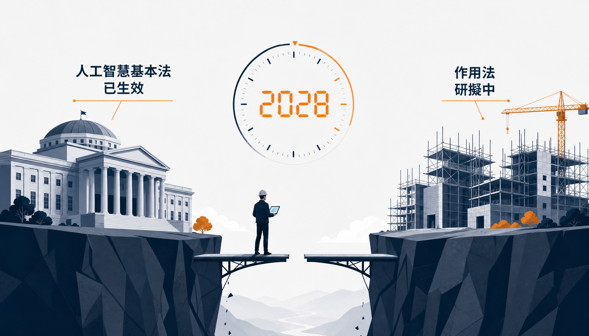
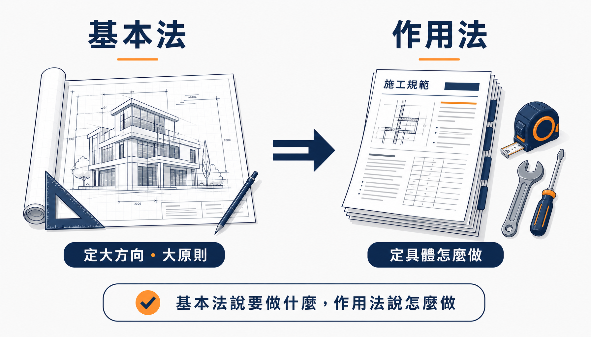
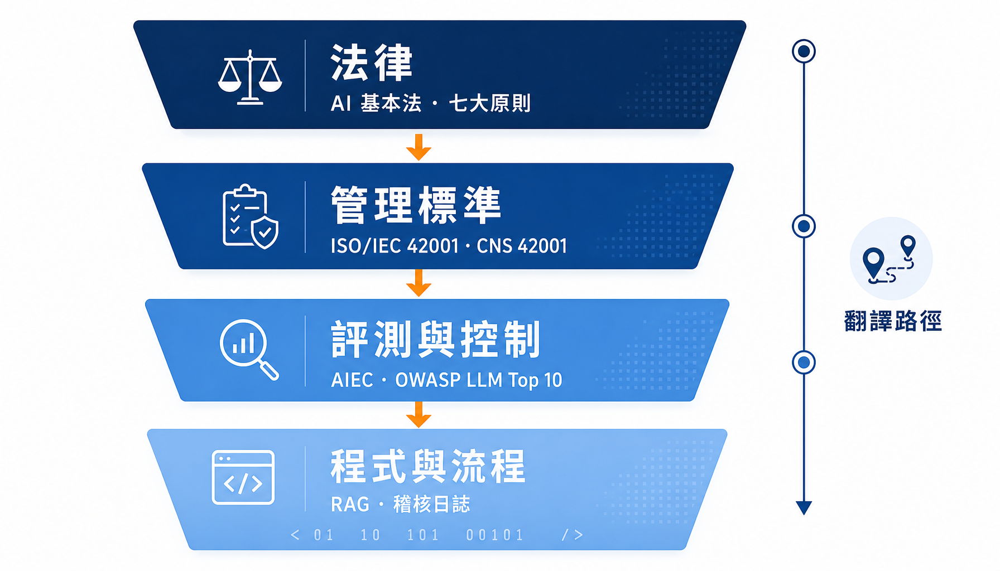
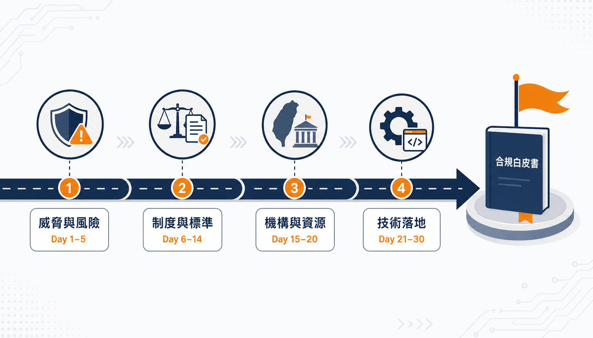
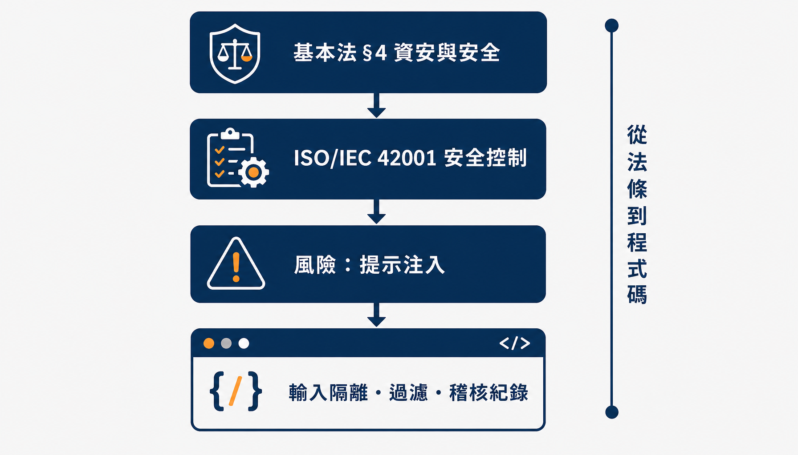

# Day 01：開場——法律過了，作用法還沒到，開發者卡在最關鍵的縫隙

> **階段一｜為什麼要管：威脅與風險**



## 寫在最前面：這個系列是寫給誰看的？

先講清楚一件事，因為它決定你要不要花 30 天跟完這個系列。

這 30 天，我想寫給**每一個對「人工智慧要怎麼管、怎麼做才安全」感到好奇的人**——不管你是正在寫程式的工程師、要跑採購的公務員、被主管叫去回一份標案的專案經理，還是單純聽到「人工智慧要立法了」覺得跟自己有關、想搞懂的一般讀者。所以我會刻意把每個專有名詞從零解釋清楚，第一次出現時寫出完整的中英文全名，之後才用簡稱；也會盡量用生活化的比喻，讓沒有技術背景的人也跟得上。已經是行家的讀者，可以把基礎說明當快速複習，重點放在後面的對映與實作。

那我們正式開始。今天是第一天，我只想把一件事講清楚：**我們正站在一個很特別的時間點上，而這個時間點，剛好卡住了一大群人。**

## 先看三個真實會發生的場景

抽象的道理不好懂，我們從三個具體場景切入。你很可能就是其中某一個人，或者你身邊就有這樣的人。

**場景一：接了人工智慧的工程師。** 你在一家新創公司寫程式，公司產品是一套接了**人工智慧（Artificial Intelligence，以下簡稱 AI）**的線上客服系統。某天，業務同事丟來一份政府標案文件——這種文件正式名稱叫**需求建議書（Request for Proposal，以下簡稱 RFP）**，簡單說就是「甲方把想要的東西條列出來，請廠商報價與說明」的文件。這份 RFP 裡有一頁寫著：「投標廠商應說明其人工智慧系統之資訊安全防護措施、風險評估機制與可追溯性設計。」業務問你：「這個我們有嗎？你幫忙寫一下。」你打開電腦，卻愣住了——我們的「風險評估機制」是什麼？那些防止 AI 被騙的技術，算不算要寫進去？你發現，自己根本不知道從哪裡開始。

**場景二：跑採購的醫院資訊人員。** 你在醫院的資訊室工作，院方想導入一套 AI 輔助判讀系統。採購流程跑到一半，冒出一份「資通系統委外開發資安檢核表」和一份自評表，裡面的詞彙是「存取控制」「稽核軌跡」「風險評鑑」。而廠商簡報裡的詞彙是「準確率 95%」「檢索增強生成架構」「向量資料庫」。這兩套語言中間，沒有翻譯——而被指派去做翻譯的人，是你。

**場景三：被客戶問倒的廠商。** 你就是那家廠商。客戶在會議上問：「你們的 AI 有符合《人工智慧基本法》嗎？」你知道這部法過了，也大概知道它是個「原則性的大方向」，但「符合基本法」到底是什麼意思？要拿出什麼證明？你回去查，發現各部會的具體規範，大多還在「研擬中」三個字。**可是客戶下個月就要驗收，你不能叫他等兩年。**

這三個場景，主角的身分天差地遠，但他們卡住的地方一模一樣：**法規的要求，已經真實地出現在他們的工作裡了；但法規本身，卻還沒給出可以直接照做的答案。** 這個「有要求、沒答案」的空檔，就是這整個系列想要填補的縫隙。而要理解這個縫隙為什麼會存在，我們得先把時間軸攤開來看。

## 為什麼會有這個縫隙？一條被立法者按下的「兩年倒數計時」

### 先分清楚兩個詞：「基本法」和「作用法」

要看懂這個縫隙，得先理解一組法律上的基本概念，我用最白話的方式解釋。

- **基本法**：可以想像成一部法律的「憲法級大綱」。它負責定「大方向、大原則、誰負責管」，但**刻意不寫細節**。它像是蓋房子時的整體設計藍圖，告訴你這裡要有客廳、那裡要有廚房，但不會告訴你插座裝在牆上幾公分、水管用哪個型號。
- **作用法**：則是真正「管到你日常行為」的細部規定，通常由各個主管機關（法律上稱「目的事業主管機關」，就是各個依權責分工的部會）根據基本法的授權，再另外訂定。它是設計藍圖底下那一疊「施工規範」，寫明插座幾公分、水管什麼型號。

一句話總結：**基本法告訴你「要做什麼」，作用法告訴你「具體怎麼做」。** 而我們現在面對的縫隙，正是「基本法已經生效，但作用法大多還沒生出來」。



### 把時間軸攤開

- **2025 年 12 月 23 日**：立法院三讀通過《人工智慧基本法》——這是台灣第一部專門規範 AI 的法律。
- **2026 年 1 月 14 日**：總統正式公布，全文共 20 條，並依第 20 條「自公布日施行」，也就是說，**它已經生效了**。
- **現在**：基本法生效了，但如同前面說的，它是一部「基本法」——只定原則、定權責、定方向，**不定罰則、不定具體技術要求**。真正會管到工程師程式碼、管到採購檢核表的「作用法」，大多還握在各部會手上，正在慢慢研擬。
- **2028 年 1 月 14 日前**：這裡是關鍵。《人工智慧基本法》第 18 條明白要求，各主管機關必須在本法施行後**二年內**，完成所主管相關法規的制定、修正或廢止。

看到了嗎？**立法者自己在條文裡，放了一個長達兩年的倒數計時器。** 我們現在，就站在這個倒數的中段——大方向的原則已經生效，但細部的施工規範還在路上。這，就是那個縫隙的由來。

### 這個縫隙，對前面三位主角意味著什麼？

這段空檔期，帶來三個非常實際的影響：

1. **合規要求不會等作用法。** 標案、醫院採購、金融業委外——甲方的檢核表，現在就已經在引用「AI 治理」「風險評估」「可信任 AI」這些詞了。作用法還沒出來，不代表你可以不回答，只代表**現在沒有標準答案可以照抄**。場景一的工程師、場景三的廠商，卡的就是這個。
2. **先看懂骨架的人，享有先行者優勢。** 作用法不會憑空長出來，它一定會沿著三樣東西生長：基本法的原則、國際上已經成熟的標準、以及台灣既有的評測驗證制度。現在先把這個骨架讀懂，等細則落地時，你只是在「填空」，而不是從頭「重學」。
3. **這是把「合規」內建進系統的最佳時機。** 趁系統還沒被規範綁死之前，就把安全防護、權限控制、稽核紀錄這些東西設計進架構裡，成本遠低於事後才補。等作用法落地才動工的團隊，做的是「補考」；現在就開始的團隊，做的是「開卷考」。

所以，這個系列的立場很明確：**與其焦慮地等答案，不如現在就把骨架讀懂、把地基打好。** 而要打地基，我們需要一套方法。

## 這個系列的方法：把「法規」一路翻譯成「程式碼」

### 定位：法規是骨架，資安是血肉

先把這個系列的定位講死，因為它決定了內容的走向。

**這不是一個法律讀書心得的系列。** 本系列參加的是資訊安全（以下簡稱資安）類的競賽組別，所以法規與技術的份量，我盡量抓五五分。這兩者，缺一都不成立：

- **只有法規、沒有技術**，你會得到一疊漂亮、但沒有人知道該怎麼落地的政策文件——這是很多「AI 治理」文章的通病，讀完很有道理，卻不知道明天上班要改哪一行程式。
- **只有技術、沒有法規**，你做了一堆很厲害的防護，卻對不上任何一張檢核表，等到稽核或投標時，一樣拿不出「符合規範」的證據——這是很多資安工程師的痛。

所以整個系列，其實只做一件事：**把上層的法規標準，一路翻譯到下層可以實際執行的技術控制與程式碼。**

### 這條翻譯路徑，長什麼樣子？

空講太抽象，我用一張「四層翻譯」的圖來說明。你可以想像成把一句「高高在上的法律原則」，一層一層往下轉譯，直到變成工程師電腦裡真的能跑的程式：



**第一層：法律。** 最上層是《人工智慧基本法》。它的第 4 條給了七大原則，其中一條（第 4 款）要求 AI 的研發與應用「應建立資安防護措施，防範安全威脅及攻擊」。注意它的語氣——它告訴你**「要」**做到資安，但完全沒說**「怎麼」**做。這一層是方向，不是做法。

**第二層：管理標準。** 中間偏上這層，是把原則翻成「一套可以照著跑的管理制度」的國際標準。最具代表性的，是一部叫 **ISO/IEC 42001** 的標準（它是全球第一套「AI 管理系統」標準；台灣也在 2026 年 6 月發布了採用它的國家標準 **CNS 42001**）。這層開始有「可以被稽核」的形狀——它告訴你要有哪些政策、哪些流程、哪些紀錄，但它仍然不碰任何一行程式碼。

**第三層：評測與控制。** 中間偏下這層，把管理要求，對映到「具體要防哪些風險」。這裡有兩個主角：一個是台灣的 **AI 產品與系統評測中心（AI Evaluation Center，以下簡稱 AIEC）** 的十大評測項目；另一個是國際資安社群整理的 **OWASP Top 10 for LLM Applications**（大型語言模型應用程式的十大風險清單）。到這一層，你已經聞得到程式碼的味道了——它開始講「提示注入」「資料外洩」這些具體攻擊。

**第四層：程式與流程。** 最底層，就是工程師的日常了：一段過濾惡意輸入的程式、一道檢查權限的關卡、一份防止被竄改的紀錄檔、一套可以重複執行的攻擊測試腳本。這一層，是本系列第四階段（Day 21 到 Day 30）真的會動手做出來的東西。

大部分談 AI 治理的內容，只停在第一層或第二層——講完原則、講完標準就結束了。**這個系列的賭注是：四層全部走完，而且走得通。** 讓每一段程式碼，都找得到它對應的法規座標；讓每一條法規原則，都落得到一段真的能跑的程式。

## 30 天的地圖，與一個貫穿全程的範例

### 四個階段，回答四個問題

這 30 天，我把它切成四個階段，每個階段回答一個問題：



| 階段 | 天數 | 主題 | 這段要回答的問題 |
| --- | --- | --- | --- |
| 一 | Day 1–5 | 威脅與風險 | 為什麼要管？ |
| 二 | Day 6–14 | 制度與標準 | 誰在管、用什麼管？ |
| 三 | Day 15–20 | 機構與資源 | 台灣有哪些工具與機構？ |
| 四 | Day 21–30 | 技術落地 | 合規怎麼變成程式與流程？ |

**第一階段（Day 1–5）：為什麼要管。** 我不打算一開始就搬法條，而是先從「攻擊」講起。明天 Day 2 先講清楚「AI 應用的資安，跟傳統資安差在哪」（劇透：傳統的防火牆，擋不住一句好好說的話）；Day 3 用前面提到的十大風險清單，把威脅全景盤一遍；Day 4、Day 5 直接動手示範，讓你親眼看到一個沒防護的 AI 系統怎麼被騙、怎麼把不該說的話全講出來。**先讓你看到危險，再來談為什麼需要制度。**

**第二階段（Day 6–14）：誰在管、用什麼管。** 這是法規的骨幹。Day 6 到 Day 8 讀懂《人工智慧基本法》：立法背景、由誰負責、七大原則。Day 9 到 Day 13 是全系列最硬的一段——把 ISO/IEC 42001 這部管理標準逐條款拆開來講，讓你知道「一套可稽核的 AI 管理制度」長什麼樣。Day 14 則對接國際上另外兩套重要框架：**歐盟人工智慧法（EU AI Act）** 與**美國國家標準暨技術研究院的人工智慧風險管理框架（NIST AI Risk Management Framework，簡稱 NIST AI RMF）**，說明為什麼在台灣做好一套標準，可以同時應付好幾個國家的要求。

**第三階段（Day 15–20）：台灣有哪些機構與資源。** 這階段畫一張「台灣 AI 治理地圖」：國家科學及技術委員會（國科會）、數位發展部各自管什麼；前面提過的 AIEC 評測中心、底下的測試實驗室與驗證機構怎麼分工；以及那十大評測項目，為什麼可以直接當成你的檢核表骨架。

**第四階段（Day 21–30）：技術落地。** 這是把前面所有東西「做出來」的階段。我們會從零搭一個最小、可以公開教學用的 **檢索增強生成（Retrieval-Augmented Generation，以下簡稱 RAG）** 系統——簡單說，就是一個「會先查公司資料、再根據資料回答」的 AI 客服。然後一層一層幫它加上防護：資料的治理、輸入的過濾、輸出的把關、權限的控制、攻擊的測試、紀錄的留存。**每一個技術動作，我都會標註它對應到哪一條法律原則、哪一個管理標準、哪一項評測項目**——這就是「讓每段程式碼都有法規座標」的具體實踐。

### 最終產出：一份可以直接拿去用的白皮書

Day 29 到 Day 30，我會把前面全部收斂成一份《AI 專案資安合規檢核表 / 白皮書》。這份文件的每一個檢核項目，都會附上一條完整的鏈路：**對應哪條原則 → 對應哪個標準 → 對應哪項評測 → 用什麼技術來驗證。** 寫完之後，本文開頭那三位卡住的主角（老實說，也包括過去的我自己），就有了一份可以直接翻開來照做的答案。

### 給你一個具體的預覽：一條法規，怎麼變成四行程式的守則

為了不讓「從法條到程式碼」淪為空話，我用一條真實的鏈路收尾，讓你先嚐一口後面的味道。

《人工智慧基本法》第 4 條第 4 款（資安與安全原則）要求 AI「應建立資安防護措施，防範安全威脅及攻擊」。這句高高在上的話，落到一個 RAG 客服系統，會變成什麼具體的守則？像這樣：

```text
《人工智慧基本法》§4 第 4 款「資安與安全」
  └─ 對應 ISO/IEC 42001 的控制要求：AI 系統生命週期中要有安全控制
       └─ 對應具體風險：提示注入（Prompt Injection，用一句話騙過 AI）
            └─ 落到程式碼（Day 23 會實作）：
                 1. 把「開發者的設定」和「使用者的輸入」硬性隔離開
                 2. 把 AI 查到的資料標記為「不可信」，禁止當成命令執行
                 3. 加一道輸入過濾的關卡，偵測可疑的攻擊語句
                 4. 每一次的過濾決策，都寫進紀錄檔（這同時滿足了第 4 條的「問責」原則）
```



請特別注意最後一行：一個做對的技術動作，常常會**同時回答好幾條法律原則**——輸入過濾防的是攻擊（滿足「資安與安全」原則），而過濾時留下的紀錄，就是出事後可以追查責任的證據（滿足「問責」原則）。**這就是我們要追求的境界：合規不是在系統外面貼一張標籤，而是把這些對應關係，設計進架構的骨子裡。** 這，正是第四階段每一天要做的事。

最後補一句本系列引用資料的原則，也給同樣想寫這類主題的人參考：法律條文依《著作權法》第 9 條規定，不能成為著作權的標的，所以像《人工智慧基本法》這樣的法律，我可以放心引用原文；但 ISO、CNS 這類標準，是受著作權保護的私有文件，本系列一律只用自己的話轉述、並註明版本與條號，絕不逐字照抄。這是分寸，也是這個公開系列該有的自律。

## 小結與明日預告

今天是開場，我只紮實地做了一件事：**把「縫隙」講清楚。** 幫你把重點收攏成幾句：

- 《人工智慧基本法》已於 2025 年 12 月 23 日三讀、2026 年 1 月 14 日公布施行，是台灣第一部 AI 專法，**現在已經生效**；
- 但它是「基本法」，只定原則；真正管到程式碼的「作用法」，各部會還有到 2028 年初、長達兩年的窗口在慢慢研擬；
- 而合規要求（標案、採購、自評表）**不會等作用法**，它現在就已經出現在開發者、採購人員、廠商的工作裡了；
- 面對這個縫隙，本系列的方法是：用 30 天，把法規骨架（基本法、ISO/IEC 42001、EU AI Act、NIST AI RMF、台灣評測體系）與資安血肉（十大風險、注入攻防、外洩防護、紅隊測試、稽核紀錄）縫在一起，最後產出一份可以直接使用的檢核表白皮書。

**明天（Day 2），我們先把法條放到一邊，回到工程師的主場，回答一個很基礎但很關鍵的問題：AI 應用的資安，到底跟傳統資安差在哪？** 為什麼你架了防火牆、做了滲透測試、通過了弱點掃描，卻仍然能被一句精心設計的中文，騙得把不該說的話全部說出來？我們明天，從「自然語言本身就是一種攻擊武器」這件事開始講起。

---
- 參考條文／出處：《人工智慧基本法》（2026/1/14 公布，全文 20 條），全國法規資料庫；30 天大綱見本系列 README。
